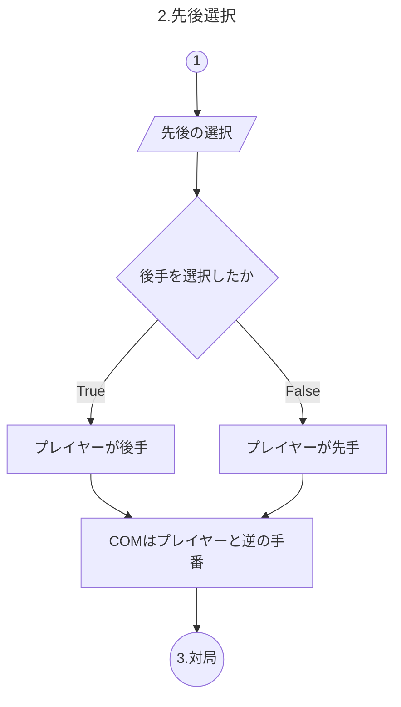

```mermaid
---
title: 2.先後選択
---
flowchart TD
1((1))-->Select[/先後の選択/]
Select-->BorW{後手を選択したか}
BorW-->|True|First[プレイヤーが後手]
First-->ComStone[COMはプレイヤーと逆の手番]
BorW-->|False|Second[プレイヤーが先手]
Second-->ComStone
ComStone-->3((3.対局))
```