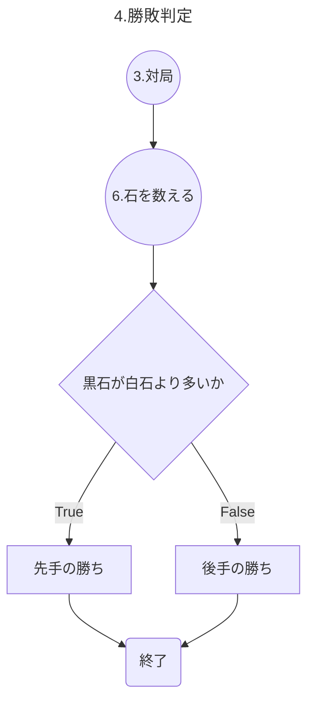

```mermaid
---
title: 4.勝敗判定
---
flowchart TD
3((3.対局))-->6((6.石を数える))
6-->Compare{黒石が白石より多いか}
Compare-->|True|FirstWin[先手の勝ち]
Compare-->|False|SecondWin[後手の勝ち]
FirstWin-->End(終了)
SecondWin-->End(終了)
```