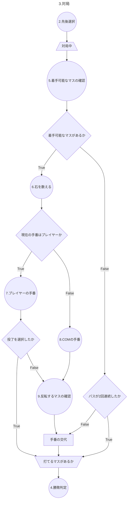

```mermaid
---
title: 3.対局
---
flowchart TD
2((2.先後選択))-->Play[/対局中\]
Play-->5((5.着手可能なマスの確認))
5-->Valid{着手可能なマスがあるか}
Valid-->|True|6((6.石を数える))
6-->Current{現在の手番はプレイヤーか}
Current-->|True|7((7.プレイヤーの手番))
7-->Surrender{投了を選択したか}
Surrender-->|True|End[\打てるマスがあるか/]
Surrender-->|False|9((9.反転するマスの確認))
Current-->|False|8((8.COMの手番))
8-->9
9-->Change[手番の交代]
Change-->End
Valid-->|False|Passed{パスが2回連続したか}
Passed-->|True|End
Passed-->|False|Change
End-->4((4.勝敗判定))
```