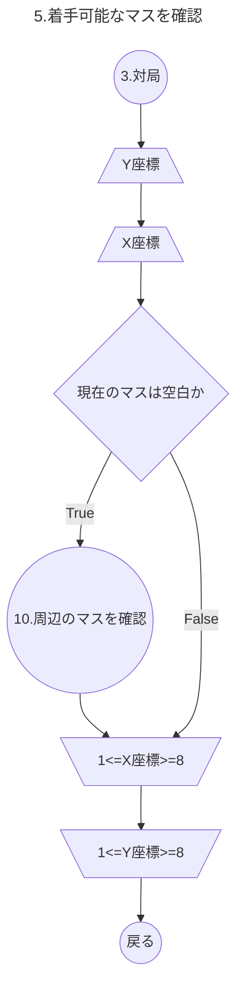

```mermaid
---
title: 5.着手可能なマスを確認
---
flowchart TD
3((3.対局))-->LoopYStart[/Y座標\]
LoopYStart-->LoopXStart[/X座標\]
LoopXStart-->IsSpace{現在のマスは空白か}
IsSpace-->|True|10((10.周辺のマスを確認))
10-->LoopXEnd[\1<=X座標>=8/]
LoopXEnd-->LoopYEnd[\1<=Y座標>=8/]
LoopYEnd-->Back((戻る))
IsSpace-->|False|LoopXEnd
```