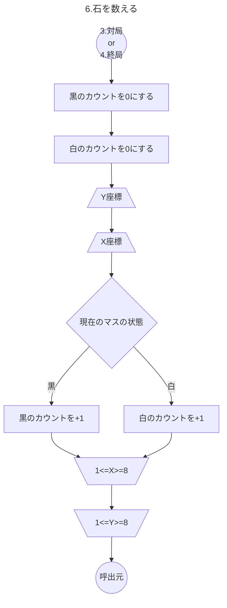

```mermaid
---
title: 6.石を数える
---
flowchart TD
3((3.対局\nor\n4.終局))-->BlackReset[黒のカウントを0にする]
BlackReset-->WhiteReset[白のカウントを0にする]
WhiteReset-->LoopYStart[/Y座標\]
LoopYStart-->LoopXStart[/X座標\]
LoopXStart-->Coordinate{現在のマスの状態}
Coordinate-->|黒|Black++[黒のカウントを+1]
Coordinate-->|白|White++[白のカウントを+1]
Black++-->LoopXEnd[\1<=X>=8/]
White++-->LoopXEnd[\1<=X>=8/]
LoopXEnd-->LoopYEnd[\1<=Y>=8/]
LoopYEnd-->Back((呼出元))
```